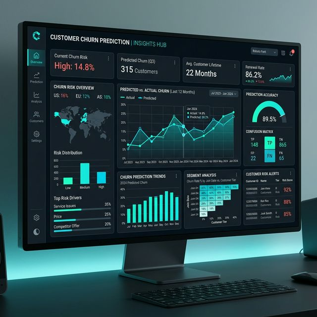
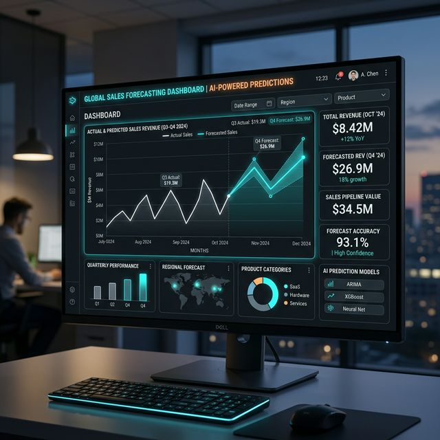
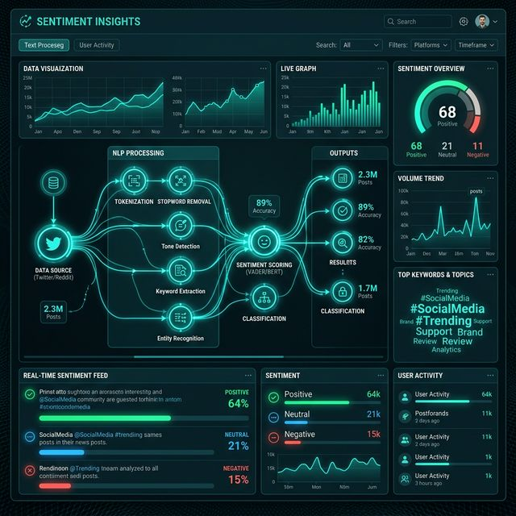

<div align="center">
  
  <h1>Vineet Baghel | Data Science Portfolio</h1>
  <p>An elegant, premium, dark-themed portfolio showcasing my journey and projects in Machine Learning and Data Science.</p>

  <p>
    <a href="https://nextjs.org/"></a>
    <a href="https://tailwindcss.com/"></a>
    <a href="https://www.framer.com/motion/"></a>
    <a href="https://react.dev/"></a>
  </p>
</div>

---

## 🚀 About the Project

This is a totally bespoke, blazing-fast personal portfolio built from the ground up using **Next.js 15** (App Router), styled completely with the new **Tailwind v4**, and animated heavily with **Framer Motion**.

It features a strict, highly elegant dark mode palette leveraging deep blacks (`#0a0a0a`) and striking cyan/teal accents (`#14b8a6`). This ensures the aesthetic feels rich, premium, and sophisticated enough to perfectly reflect my background in Data Science and disruptive AI technologies.

---

## ✨ Key Features
- **Dynamic Role Animation**: The hero section smoothly cycles through my core titles using `AnimatePresence`.
- **Interactive "Bento Box" Layout**: The "About Me" section utilizes gorgeous glassmorphism and grid-card layouts.
- **Projects & Certifications**: High-quality visual cards featuring hover-zoom interactions, tagging systems, and external verified credential links.
- **Web3Forms Integration**: A completely functional, server-less contact form hook integrated flawlessly.
- **Vercel Ready**: Custom `vercel.json` and `.gitignore` configured out-of-the-box for clean routes and instant deployment.

---

## 🖼️ Gallery

<details>
<summary><b>Click to expand and view Portfolio Assets</b></summary>
<br>

<div align="center">
  
  
  
  
</div>

</details>

---

## 🛠️ Technology Stack

- **Framework**: [Next.js 15](https://nextjs.org/)
- **Styling**: [Tailwind CSS v4](https://tailwindcss.com/)
- **Animations**: [Framer Motion](https://www.framer.com/motion/)
- **Icons**: [Lucide React](https://lucide.dev/)
- **Forms Context**: [React Hook Form](https://react-hook-form.com/)
- **API Fetching**: Native Fetch -> [Web3Forms](https://web3forms.com/)

---

## 💻 Getting Started Locally

To run this beautifully crafted portfolio on your own machine:

```bash
# 1. Clone the repository
git clone https://github.com/Vivekb638/Vineet-Portfolio.git

# 2. Navigate to the directory
cd Vineet-Portfolio

# 3. Install dependencies
npm install

# 4. Start the development server
npm run dev
```

Open [http://localhost:3000](http://localhost:3000) with your browser to see the result.

---

## 📬 Contact

- **Name**: Vineet Baghel
- **Email**: contact@vineetbaghel.com
- **LinkedIn**: [baghel-vineet](https://www.linkedin.com/in/baghel-vineet/)

<br>
<div align="center">
  <i>Built with ☕ and structured data.</i>
</div>
